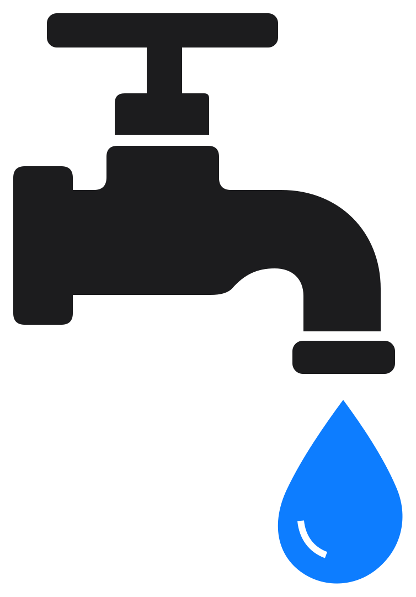

<p align="center">
  <picture>
    <source media="(prefers-color-scheme: dark)" srcset="docs/assets/logo-dark.svg">
    
  </picture>
</p>

<h1 align="center">Tolaria Clipper</h1>

<p align="center">
  A browser extension that saves web pages into a <a href="https://tolaria.md/">Tolaria</a>
  vault as Markdown, without launching or focusing the app.<br>
  A fork of <a href="https://github.com/obsidianmd/obsidian-clipper">obsidianmd/obsidian-clipper</a> v1.7.1.
</p>

## What it does

Tolaria Clipper turns the page you are reading into a Markdown note in your vault. It pulls
out the article — headings, code, tables, images — leaves the navigation and the cookie
banners behind, runs it through a template you control, and writes the file.

It exists because clipping should not interrupt reading. The note goes straight into the
vault folder and Tolaria's filesystem watcher picks it up on its own, so the app never comes
to the front — it does not even have to be running. You stay on the page you were reading.

## Features

- **Writes straight into the vault**, through a native messaging host, so a clip never
  launches or focuses Tolaria — [docs/native-host.md](docs/native-host.md)
- **Notes shaped for Tolaria**: the H1 carries the title, filenames are short kebab-case,
  notes land at the vault root, `belongs_to` and `related_to` are left as empty keys to fill
  in later
- **Several vaults**, read from Tolaria's own registry — never a path handed over by the
  browser
- **Clip the whole page, the current selection, or the passages you highlighted**, depending
  on what the template asks for
- **Highlighter** that persists per page and comes back on your next visit
- **Reader mode** that strips a page down to its text before you clip it
- **Templates per site**, triggered by URL or by schema.org data, with typed properties,
  page variables, meta tags and 54 filters — [docs/templates.md](docs/templates.md)
- **Behaviours**: create a note, append or prepend to an existing one, overwrite it, or add
  to the daily note
- **Interpreter**: fill template fields with a language model, twelve providers preconfigured
  and Ollama for a local one — [docs/interpreter.md](docs/interpreter.md)
- **Keyboard shortcuts, context menu and a side panel**
- **Copy as Markdown** to the clipboard, without saving anything
- **A CLI and a Node API**, for clipping from scripts
- **36 languages**
- **Nothing leaves your machine**, apart from the interpreter requests you configure yourself

## What changed from upstream

**Clipping no longer steals focus.** Upstream hands the note to the app through an
`obsidian://new?file=…&content=…` URL, and that navigation is what brings the app to the
front on every single clip. Tolaria's `tolaria://` links are navigation-only by design and
have no equivalent, so this fork writes the `.md` file into the vault folder directly,
through a native messaging host. Tolaria's filesystem watcher picks it up — app closed,
app in the background, it does not matter. See [docs/native-host.md](docs/native-host.md).

**Notes are shaped for Tolaria's model.** The first H1 in the body is the title, because
that is what Tolaria reads for note lists, search, wikilink suggestions and tabs. Filenames
are short kebab-case. Notes land at the vault root, since Tolaria organises by `type` and
relationships rather than folders. `belongs_to` and `related_to` are emitted as empty keys
so a fresh clip shows up in "to process" views. `tags:` is gone — a list of plain strings
creates no graph edges in Tolaria, so it looked like structure without being any.
See [docs/templates.md](docs/templates.md).

## Install

**Not on the Chrome Web Store yet.** For now the extension installs in developer mode, from
a downloaded archive or from a checkout. Chrome and Arc are the supported targets; Firefox
and Safari builds still compile and fall back to downloading a `.md` file, but the native
host is not wired up for them.

### From the archive

1. Download `tolaria-clipper-<version>.zip` from
   [the latest release](https://github.com/reverall/tolaria-clipper/releases/latest) and
   unzip it **somewhere permanent**. Chrome stores the path to an unpacked extension rather
   than its contents, so one loaded from `~/Downloads` stops working the day you tidy up.
2. Open `chrome://extensions` (or `arc://extensions`), enable **Developer mode**, click
   **Load unpacked**, and select the `extension/` folder from the archive.
3. From the unzipped folder, once:

   ```
   node connect.cjs
   ```

   That registers the native host with your browsers. It needs Node 18 or later, and it
   cannot be a file you simply copy: Chrome requires an absolute path to the helper, and the
   helper an absolute path to Node, neither of which is knowable before the archive reaches
   your machine.
4. Clip a page. Tolaria should not come to the front.

The extension id is pinned by the manifest's `key` field, so moving the folder and loading
it again keeps the host registration valid. To update, replace `extension/` with the one
from the new archive and press **Reload** on the extension card.

### From source

```
npm install
npm run install:local
```

That builds the extension, builds and registers the native host, and copies the extension to
a stable directory. Then open `chrome://extensions`, enable **Developer mode**, and load it
from that directory — **not** from `dist/`, which is rebuilt on every build and would break
the pinned extension id. [docs/native-host.md](docs/native-host.md) explains why, and what to
do when a clip does not land.

### Check the install

```
node connect.cjs doctor    # from the archive
node dist/cli.cjs doctor   # from a checkout
```

## Running alongside Obsidian Web Clipper

Both extensions can be installed in the same browser profile. Everything they inject into
a page — element ids, CSS classes, custom properties, the `CSS.highlights` registry entry,
window globals, custom events — is namespaced under `tolaria-`, so the two do not fight
over the same nodes.

One thing is not solvable in code: Chrome grants a suggested keyboard shortcut to only one
extension. Whichever you install second starts with no shortcuts, silently. This fork uses
different defaults (`Ctrl/Cmd+Shift+Y`, `Alt+Shift+Y`, `Alt+Shift+J`, `Alt+Shift+K`) to
reduce the overlap, but check `chrome://extensions/shortcuts` after installing.

## Documentation

- [Native host](docs/native-host.md) — how clips reach the vault, install and diagnostics
- [Templates](docs/templates.md) — templates, variables and filters
- [Interpreter](docs/interpreter.md) — extracting data with a language model

## Develop

```
npm run build          # chrome, firefox and safari builds
npm run build:chrome   # just chromium
npm run package        # the downloadable archive, into builds/
npm test               # vitest
npm run check-strings  # report unused locale keys
```

Builds land in `dist/`, `dist_firefox/` and `dist_safari/`. `package` wipes `dist/` first,
so what it copies into the archive is the extension and nothing else; it leaves
`builds/tolaria-clipper-<version>.zip` ready to attach to a release.

Translations live in [src/_locales](src/_locales); `en` is the source of truth and every
other locale falls back to it for missing keys.

## Third-party libraries

- [webextension-polyfill](https://github.com/mozilla/webextension-polyfill) for browser compatibility
- [defuddle](https://github.com/kepano/defuddle) for content extraction and Markdown conversion
- [dayjs](https://github.com/iamkun/dayjs) for date parsing and formatting
- [lz-string](https://github.com/pieroxy/lz-string) to compress templates to reduce storage space
- [lucide](https://github.com/lucide-icons/lucide) for icons
- [dompurify](https://github.com/cure53/DOMPurify) for sanitizing HTML

## Thanks

This is a fork of [Obsidian Web Clipper](https://github.com/obsidianmd/obsidian-clipper),
built by [@kepano](https://github.com/kepano) and the Obsidian team, and released under the
MIT licence.

Nearly everything worth using here came from them: the content extraction, the template
engine with its variables and 54 filters, the reader mode, the highlighter, the interpreter,
and translations into 36 languages. Years of work on the hard parts of turning a web page
into a decent Markdown note — including [Defuddle](https://github.com/kepano/defuddle),
which does the extraction and is a fine library in its own right.

What this fork changes is narrow by comparison: where the note goes, and the shape it takes
once it gets there. Everything else is theirs.

Thank you.

## Licence

MIT, inherited from [obsidianmd/obsidian-clipper](https://github.com/obsidianmd/obsidian-clipper);
see [LICENSE](LICENSE), which keeps the original copyright notice alongside this fork's.

Obsidian's trademarks, icons and marketing assets are excluded from that licence and are
not present in this repository — the icons and the in-app mark are Tolaria's.
